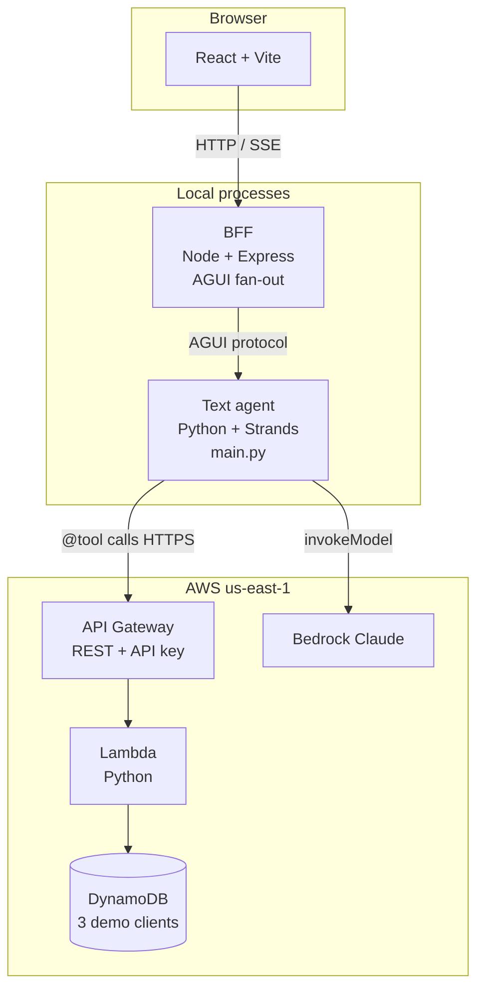
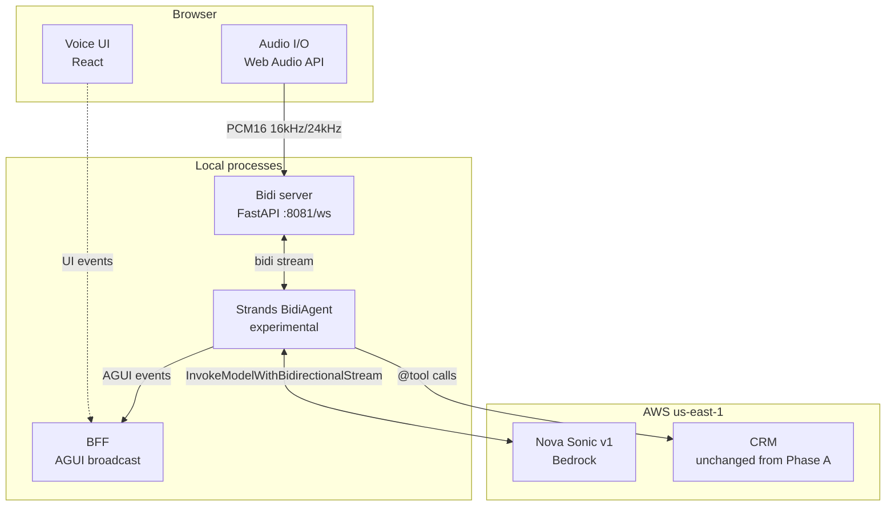
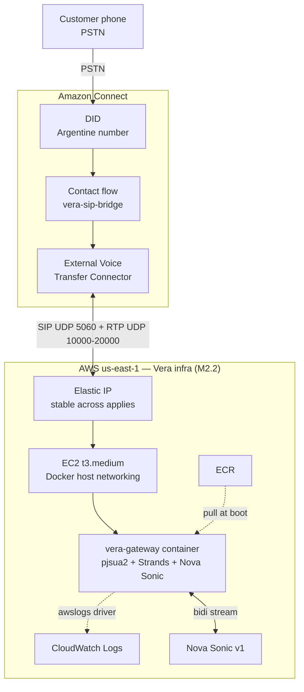

# Vera

**V**oice-**E**nabled **R**eceptionist **A**ssistant.

A reproducible reference implementation of a generative-AI conversational
agent on AWS, designed as a customer-service receptionist. The project
is built in incremental phases: text channel first, voice channel next,
telephony last — each phase end-to-end and verifiable on its own.

The first vertical implemented is consumer banking (personal loan
intake). The same scaffolding is intended to be adaptable to other
industries (healthcare, education) by replacing the CRM tools and the
system prompt.

## Project status

Phase A — Text channel. Complete. A Strands agent with three live tools
calling a real CRM (DynamoDB + Lambda + API Gateway, deployed via
Terraform). A Node BFF that broadcasts agent events to a React frontend
with four synchronized live views (user chat, flow visualization,
structured logs, Connect-style admin wallboard). End-to-end token usage,
latency, and tool-call traces are surfaced in the UI.

Phase B — Voice channel. Complete (closed at sub-stage B2.4). Real-time
voice conversation between the browser and Amazon Nova Sonic via
Strands' experimental `BidiAgent`, with the three CRM tools wired,
AGUI events flowing through the BFF, and the user view rewritten as a
voice interface. See `docs/decisions.md` for the full arc (B1.a → B2.4).

Phase C — Multi-industry kit. Complete. The agent is now parameterised
by industry via `?industry=<name>` in the URL; banking ships with a
real CRM, and salud ships as a memory-mock vertical that proved the
kit pattern is genuinely a copy-edit operation (zero changes to the
loader, agents, BFF, or frontend were needed to add it). See the
"Multi-industry" section below for how to add one and
`docs/decisions.md` for the architecture rationale.

Phase D — Telephony. In progress. Bridges Amazon Connect (PSTN inbound)
to Vera's Strands+Nova Sonic pipeline via SIP. M0 (architecture spike)
and M1 (Python SIP lane validated end-to-end on dev) closed. M2.1
(gateway image lifecycle on Fargate) and M2.2 (stable SIP/RTP endpoint
on EC2 + EIP) closed — `terraform apply` brings the full stack up;
a second `terraform apply` produces "No changes" and the EIP is stable
across deploys. M2.3 (real SIP INVITE handling + vocalization against
Connect as the SIP peer) is blocked on AWS quota `L-2BE4D75F`
("External voice transfer connectors per account"), currently at 0 in
the shared account.

Architecture decisions, considered trade-offs and discarded approaches
are recorded in [`docs/decisions.md`](docs/decisions.md). That file is
the canonical reference for *why* each choice was made.

## Phase A behavior

Vera handles personal-loan intake calls. The flow:

1. The customer states their request (e.g. identifying themselves by
   DNI and requesting an amount).
2. Vera calls `identificar_cliente` to validate identity against the CRM.
3. Vera calls `consultar_perfil_crediticio` to retrieve credit score
   and current debt-to-income ratio.
4. Vera calls `evaluar_prestamo`, which applies real industry criteria
   (DTI ≤ 36%, credit score ≥ 670) and returns one of three decisions:
   `aprobado`, `derivar_a_humano`, or `fuera_de_parametros`.
5. Vera communicates the decision in Rioplatense Spanish with tone
   appropriate to the outcome.

The agent never computes financial logic itself — it relies entirely on
the tools. All three tools are real `@tool`-decorated functions backed
by live HTTP calls to API Gateway.

## Architecture

The system is structured around three independent paths: a text channel
(Phase A), a voice channel through the browser (Phase B), and a
telephony channel through Amazon Connect (Phase D). Each path is
independently deployable and verifiable; later phases inherit the CRM
and the AGUI fan-out from earlier ones without modification.

### Phase A — text channel

The text path is browser-first: a React frontend posts to a Node BFF,
which talks to a Python agent over the AG-UI protocol. The agent calls
CRM tools (DynamoDB + Lambda + API Gateway) and Bedrock for reasoning.
The BFF fans events out to multiple frontend views so they can subscribe
to the same conversation in real time.

### Phase B — voice channel (browser)

Phase B replaces the text input with a WebSocket carrying base64 PCM16
audio. A FastAPI bidi server hosts a Strands experimental `BidiAgent`
that streams audio to Amazon Nova Sonic via Bedrock's bidirectional
API. The CRM layer and the BFF event fan-out are inherited verbatim
from Phase A — voice does not change the CRM or the monitoring views.

### Phase D — telephony (Amazon Connect)

Phase D is independent of the browser path: a customer dials a PSTN
number registered in Amazon Connect, a Connect contact flow transfers
the call via an External Voice Transfer Connector to our SIP gateway,
and the gateway bridges audio to Nova Sonic the same way the browser
path does. There is no BFF or frontend involved — telephony is a closed
audio loop between Connect and the gateway. **M2.3 is currently blocked
on AWS quota `L-2BE4D75F`** ("External voice transfer connectors per
account"), at 0 in the shared account; the gateway endpoint is live and
stable but no Connect connector can route to it yet.

## Operational layout

A full demo requires four local processes plus the deployed CRM:

| Port | Process               | Required for                                          | Start                                                       |
|------|-----------------------|-------------------------------------------------------|-------------------------------------------------------------|
| 8080 | Text agent (`main.py`) | Text-fallback button in `?view=user`; `/metrics` for BFF | `uv run main.py` (in `agent/app/vera/`)                  |
| 8081 | Bidi voice server     | Voice conversation in `?view=user`                    | `python server.py` (in `agent/app/vera/bidi/`, venv active) |
| 8787 | BFF (Node + Express)  | All frontend views (event broadcast + `/chat` proxy)  | `npm start` (in `bff/`)                                     |
| 5173 | Frontend (Vite)       | The UI itself                                         | `npm run dev` (in `frontend/`)                              |

To avoid the four-terminal ritual, `./dev.sh start|stop|status|restart|logs`
manages all four as background processes (logs in `tmp/logs/`, pidfiles
in `tmp/pids/`, both gitignored). `./dev.sh status` distinguishes
`ok` / `stopped` / `zombie-port` (foreign PID holding the port) /
`crashed` (our PID died) / `orphan-listening` (port held but no live
pidfile) by cross-referencing `lsof` with the pidfile per service.
Linux-only; no tmux, no docker-compose.

The text agent (`:8080`) is required even for a voice-only demo
because the text-fallback button is always visible in `?view=user`
and posts to it through the BFF. A missing `:8080` fails with no
visible UI feedback (errors land in the BFF log and the browser
console only).

Phase D does not run on the dev machine — the SIP gateway lives on
AWS (EC2 + Docker + EIP, provisioned via Terraform in `infra/m2/`).
See [Running Phase D](#running-phase-d-m22) for the deploy path.

## Components

- `frontend/` — React + Vite + Tailwind v4. Four views (`?view=user`,
  `?view=flow`, `?view=logs`, `?view=admin`) sharing a live event stream
  from the BFF. The admin view mirrors the shape of Amazon Connect's
  real-time metrics API.

- `bff/` — Node + Express. Receives AG-UI events from the agent and
  broadcasts them to subscribed front-end clients. No business logic,
  pure fan-out.

- `agent/app/vera/` — Python + Strands. Text-channel agent (Phase A,
  `main.py`), voice-channel server (Phase B, `bidi/server.py`), and the
  Phase D canary (`bidi/gateway_stub.py`, a minimal pjsua2 stub that
  proves the M2 image is well-formed — NOT a production gateway).
  Three tools: `identificar_cliente`, `consultar_perfil_crediticio`,
  `evaluar_prestamo`. All read CRM data via authenticated HTTPS calls
  to API Gateway.

- `infra/crm/` — Terraform for the Phase A CRM. DynamoDB table seeded
  with three demo clients, Lambda handler in Python, REST API Gateway
  with API-key auth, least-privilege IAM. Single command to apply,
  single command to destroy.

- `infra/m2/` — Terraform for the Phase D telephony stack: VPC + subnets
  + SG (UDP 5060 / RTP 10000-20000) + IAM (Bedrock InvokeModel on Nova
  Sonic + ECR pull + CloudWatch Logs) + ECR + CloudWatch log group +
  EC2 (t3.medium, Amazon Linux 2023, IMDSv2, gp3 encrypted) + EIP +
  EIP association. The EIP is the stable public address Amazon Connect's
  outbound route is configured to send INVITEs to.

- `docs/decisions.md` — Decision log. Each entry records what was
  decided, why, what trade-offs were considered, and what was rejected.
  This is the file to read first if you want to understand the project's
  reasoning rather than its code.

## Stack

| Layer            | Technology                                                       |
|------------------|------------------------------------------------------------------|
| Frontend         | React 18, Vite, Tailwind v4                                      |
| BFF              | Node.js, Express, AG-UI protocol                                 |
| Text agent       | Python 3.12, Strands Agents SDK, Anthropic Claude (via Bedrock)  |
| Voice agent      | Python 3.12, Strands BidiAgent (experimental), Amazon Nova Sonic |
| Telephony gateway | Python 3.12, pjsua2 (SWIG), pjproject 2.17, Docker (host networking) |
| Telephony hosting | EC2 t3.medium (Amazon Linux 2023), Elastic IP, ECR, CloudWatch Logs    |
| Telephony ingress | Amazon Connect External Voice Transfer Connector (SIP/RTP UDP)        |
| CRM              | AWS Lambda (Python), API Gateway (REST), DynamoDB                |
| Infrastructure   | Terraform 1.15+                                                  |
| AWS region       | `us-east-1`                                                      |

## Prerequisites

Local development:

- Node.js 20+ and npm
- Python 3.12+ and [`uv`](https://docs.astral.sh/uv/)
- Terraform 1.15+
- AWS CLI v2, configured with a named profile that has permissions to
  deploy Lambda, API Gateway, DynamoDB, IAM, and to invoke Bedrock
  (`bedrock:InvokeModelWithBidirectionalStream` is required for Phase B).
  For Phase D: additionally EC2 + ECR + VPC + EIP + CloudWatch Logs + SSM.
- For Phase B on Linux: `apt install portaudio19-dev` before
  `uv sync`, otherwise PyAudio fails to compile
- For Phase D Docker builds: Docker installed and running (multi-stage
  build, ~3-4 min with warm cache)

Bedrock model access (one-time, free):

- `amazon.nova-sonic-v1:0` enabled in Bedrock → Model access (Phase B)
- The Claude model used by Phase A enabled likewise

## Running Phase A

Phase A consists of three processes running locally, plus the CRM
deployed in your AWS account.

Deploy the CRM:

~~~
cd infra
terraform init
terraform apply -var="aws_profile=YOUR_PROFILE"
~~~

Terraform prints the API endpoint and the API key. Copy them into
`agent/app/vera/.env`:

~~~
CRM_ENDPOINT=<output from terraform>
CRM_API_KEY=<output from terraform>
AWS_PROFILE=YOUR_PROFILE
~~~

Run the agent, BFF, and frontend in three terminals:

~~~
# Terminal 1 — agent
cd agent/app/vera
uv sync
uv run main.py

# Terminal 2 — BFF
cd bff
npm install
npm start

# Terminal 3 — frontend
cd frontend
npm install
npm run dev
~~~

Open `http://localhost:5173/vera-pitch/?view=user` to talk to Vera.

Note: as of Phase B sub-stage B2.2, `?view=user` is a voice interface
backed by the bidi server (see "Running Phase B" below), not the
text-input form that Phase A originally shipped. The other three
views react live to the AGUI broadcast from the BFF: `?view=flow`
lights up its `identificar` / `bedrock` / `perfil` / `evaluar` nodes
in real time as the agent fires the matching tools (the `voz` /
`transcribir` / `responder` nodes are intentional placeholders for
the future Connect stage) and exposes a "Mapa | Trace" toggle in
the header — Trace is a horizontal ReactFlow graph of the unrolled
agentic loop for the current session (`Usuario → Bedrock razona →
Tool → Resultado → Bedrock razona → Respuesta`), built live from a
`traceLog` accumulated in `AgentContext` since page-load (no
persistence, no replay across reloads); `?view=logs` streams real AGUI events
including tool results; `?view=admin` is a hybrid — a live "Vera"
agent and a real contact card (customer name from
`identificar_cliente`, state derived from running tools and
conversation lifecycle) embedded among labelled mock humans and
queued contacts that exist as wallboard scenography. See the 2026-06
errata entry in `docs/decisions.md` for how the previous "mock
dashboards" claim came to be wrong and how it was re-verified today.

## Running Phase B (closed at B2.4)

Phase B keeps the Phase A processes running and adds the bidi voice
server. The bidi server uses the same Python virtual environment as
the text agent (`agent/app/vera/.venv`), but a fresh terminal does
not activate it automatically — `source` it explicitly each time.

Three terminals (in addition to the BFF and frontend already running
from Phase A):

~~~
# Terminal 4 — bidi voice server
cd agent/app/vera/bidi
source ../.venv/bin/activate
python server.py
~~~

The bidi server listens on `ws://localhost:8081/ws`. The React frontend
connects there directly from `?view=user`, which (since B2.2) is a
voice interface: tap anywhere on the overlay to grant the microphone
gesture, then talk to Vera. Use headphones to avoid echo.

What works end-to-end as of B2.2:
- Voice conversation in `?view=user` with the CRM tools wired
  (`identificar_cliente`, `consultar_perfil_crediticio`, `evaluar_prestamo`).
- Privacy guardrails from B1.b iter-3 (DNI mismatch does not leak the
  real owner of the document).
- AGUI events from the voice conversation flow through the BFF and
  are observable by any monitor connected to `ws://localhost:8787/`.

Known caveats (tracked for future work):
- Voice fluidity in the React frontend is marginally less responsive
  than the deprecated standalone HTML used during B1.a/B1.b. Possible
  mitigation via AudioWorklet is deferred.
- Long assistant responses currently render as multiple bubbles with
  partial content duplication (Nova Sonic emits `is_final=true`
  per-sentence; the AGUI translator does not yet coalesce).

The standalone HTML at `agent/app/vera/bidi/index.html` from B1.a was
removed in B2.4 cleanup. The voice UI now lives only in PatientScreen.

## Running Phase D (M2.2)

Unlike Phases A/B, the Phase D gateway runs on AWS (EC2 + Docker + EIP),
not on the dev machine. The deploy path is local build → push to ECR
→ Terraform apply.

First deploy is two-phase because the EC2's `user_data` does
`docker pull` at boot — the ECR repo must contain the image before the
EC2 starts:

1. `terraform apply -target=...` for everything except the EC2 + EIP
   (creates VPC, IAM, ECR, log group).
2. `docker build -f agent/Dockerfile` + `docker push` populates ECR.
3. `terraform apply` (no targets) brings up the EC2; `user_data` pulls
   the image at boot.

Subsequent applies are single-pass. The exact command sequence and the
operational findings from the M2.2 validation session are in
`docs/decisions.md` ("2026-06-18 — Phase D / M2.2").

Operational notes:

- Run `aws sts get-caller-identity` before any `terraform` command —
  catches `AWS_PROFILE` drift on fresh shells.
- Never cancel a running `terraform apply` — leaves state drift
  requiring manual cleanup.
- `terraform output -raw gateway_ssm_connect_command` prints a
  ready-to-paste `aws ssm start-session` (no SSH).
- Container logs land in CloudWatch `/ecs/vera-m2-gateway` via Docker's
  `awslogs` driver.
- `terraform destroy` after each validation session (see "Cost estimate").

The container today is the `gateway_stub.py` canary: imports pjsua2,
binds UDP 5060, prints "alive" every 30s. It does NOT accept SIP
INVITEs or talk to Nova Sonic. Production gateway lands in M2.3,
blocked on AWS quota `L-2BE4D75F`.

## Multi-industry

The agent picks its tools, prompt and voice settings from a per-
industry manifest at session start. The active industry is selected
via the `industry` query parameter at every layer:

- Frontend:    `http://localhost:5173/vera-pitch/?view=user&industry=banking`
- Bidi WS:     `ws://localhost:8081/ws?industry=banking`
- Text agent:  `http://localhost:8080/invocations?industry=banking`
- BFF `/chat`: POST body `{"message": "...", "industry": "banking"}`

The default at every layer is `banking`, so links without the param
keep working as before.

Unknown industry: the voice WS closes with code 4404 and a JSON error
frame; the text path returns 502. Neither produces a visible UI signal
yet — listed in `docs/decisions.md` as deferred UX.

To add a new industry, copy `agent/app/vera/industries/banking/` to
`agent/app/vera/industries/<name>/` and edit:

- `tools.py` — `@tool`-decorated functions for this industry's
  domain. The names you export here must match what the manifest
  lists.
- `vera.yaml` — the manifest: list the tool names, point to the
  prompt file, set voice/text model IDs, set `thread_id_prefix`.
- `prompt.txt` — the system prompt.

Restart the bidi server and the text agent. The new industry becomes
selectable via `?industry=<name>`. See `agent/app/vera/industries/banking/`
as the canonical example.

Salud (`?industry=salud`) is the second vertical and ships as a
memory-mock industry: three patients live in
`industries/salud/tools.py`, and `agendar_turno` appends to an
in-process list that is lost when the agent restarts. The point is to
prove the kit pattern (manifest + loader + per-industry tools) works
without standing up a second AWS deployment. The privacy rule from
banking iter-3 — DNI mismatch must not reveal the real owner — is
consciously inherited in the salud prompt and reinforced for medical
data sensitivity. The monitoring views (see below) show their
placeholder for salud, which is the expected behaviour.

The three monitoring views (`?view=flow`, `?view=logs`, `?view=admin`)
render a placeholder for non-banking industries — their live AGUI
wiring and the banking-themed scenography around it (node labels in
flow, mock contact queue in admin) assume the banking manifest. The
Trace toggle in `?view=flow` is also gated to banking for the same
reason. This is by design, not a bug.

The user-facing voice view (`?view=user`) keeps its banking-themed
copy ("Banco · asistente con voz", "Cliente") regardless of
`?industry=`. Tracked in `docs/decisions.md` as a copy-per-industry
debt; not blocking salud usage.

## Cost estimate

Running the demo end-to-end in `us-east-1` with the default Terraform
configuration costs only a few cents per session in raw AWS usage
(Lambda invocations, DynamoDB on-demand reads, API Gateway requests,
Bedrock tokens, Nova Sonic streaming). The fixed monthly cost while
the CRM is deployed but idle is negligible — DynamoDB on-demand bills
per request, Lambda bills per invocation, API Gateway bills per
request. There are no always-on resources.

To stop billing entirely, destroy the CRM stack:

~~~
cd infra/crm
terraform destroy -var="aws_profile=YOUR_PROFILE"
~~~

Bedrock and Nova Sonic billing stops as soon as you stop invoking the
models — there is no provisioned capacity.

Phase D (M2.2) adds the EC2 + EIP stack. While running, t3.medium
($0.0416/hr) + EIP-while-attached ($0) + 20GB gp3 root volume
(~$0.002/hr) ≈ $0.044/hr. There are no always-on resources beyond
these. Apply the same destroy-after-validation pattern:

~~~
cd infra/m2
terraform destroy
~~~

Cost returns to $0 (the ECR repo is also destroyed with the stack via
`force_delete=true`).

## Repository layout

~~~
vera/
├── README.md           — this file
├── LICENSE             — MIT
├── docs/
│   └── decisions.md    — architecture decision log
├── frontend/           — React + Vite frontend (Phase A/B)
├── bff/                — Node BFF (Phase A/B)
├── agent/
│   ├── Dockerfile      — multi-stage build of the Phase D gateway image
│   └── app/vera/       — Python agent
│       ├── main.py     — text-channel agent (Phase A)
│       └── bidi/       — voice-channel server (Phase B) + gateway_stub.py (Phase D canary)
└── infra/
    ├── crm/            — Terraform for the Phase A CRM
    └── m2/             — Terraform for the Phase D telephony stack
~~~

## License

MIT. See [`LICENSE`](LICENSE).
